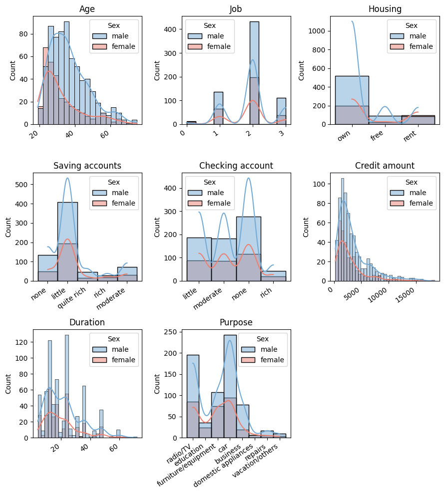
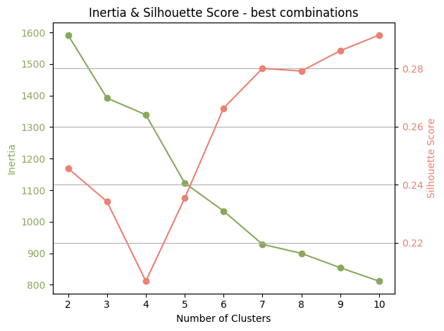
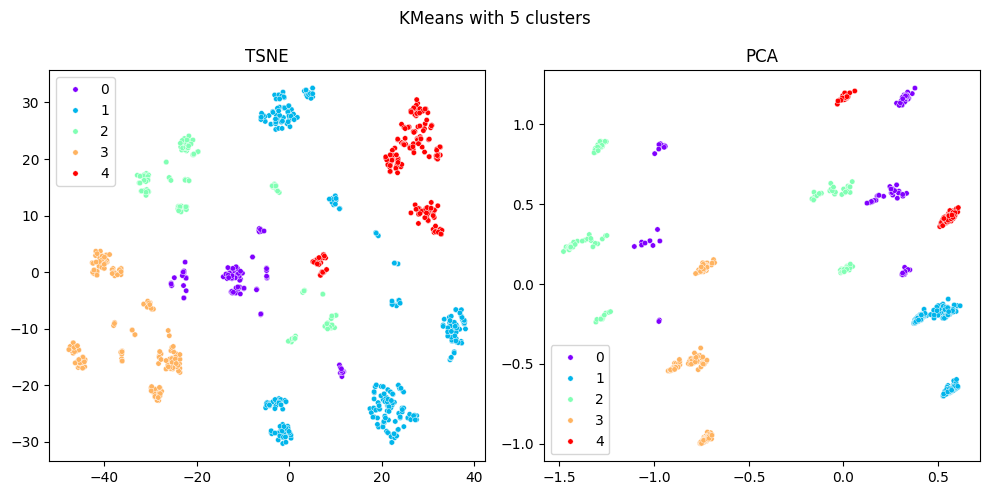
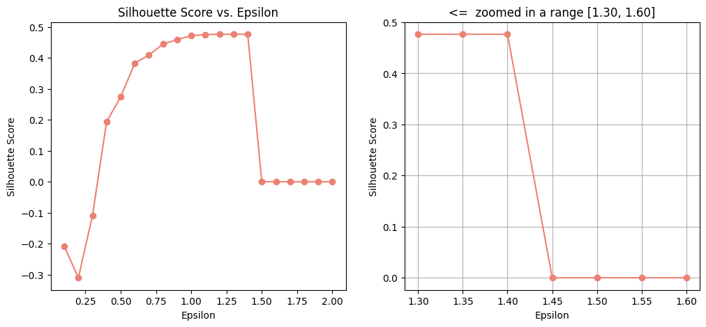
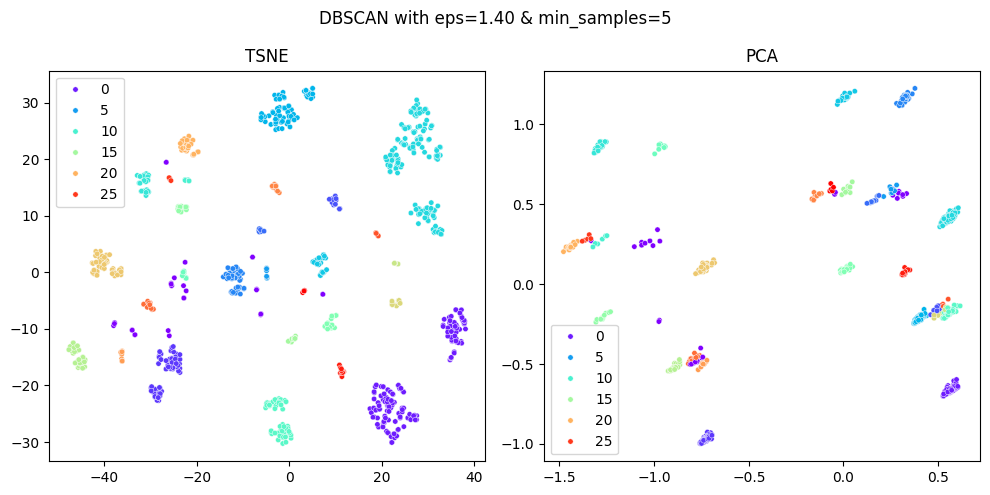
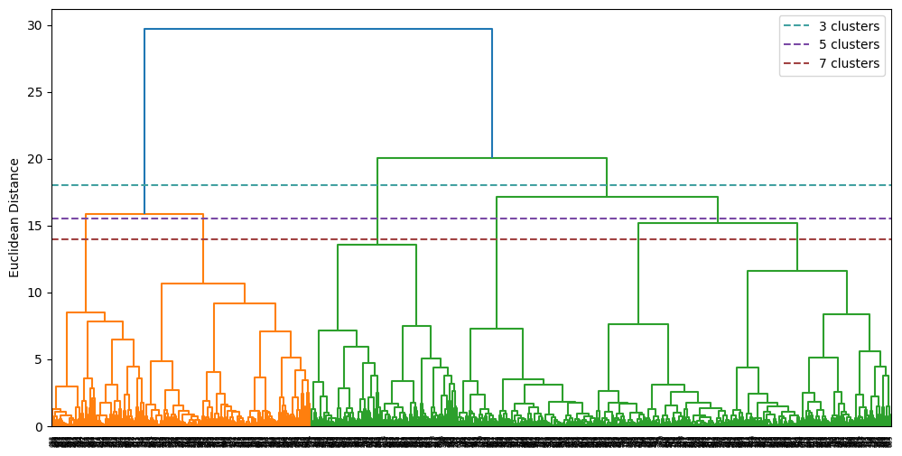
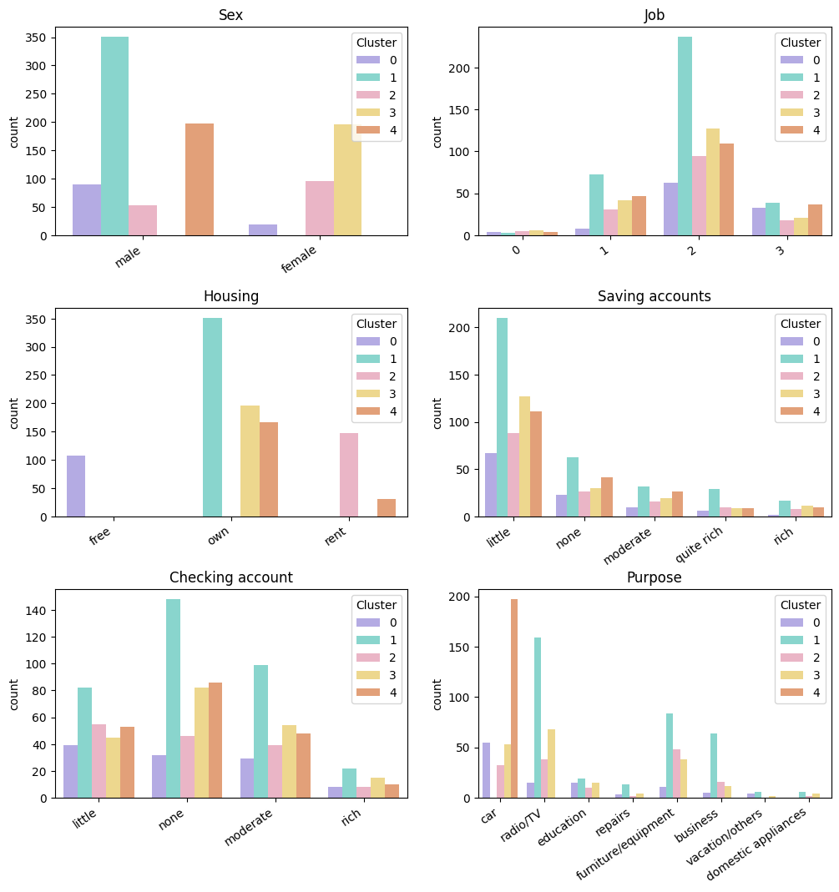

# German Credit Risk
[Kaggle dataset](https://www.kaggle.com/datasets/uciml/german-credit)

**GOAL:** client segmentation.   
**RESULT:** 5 perfectly interpretable clusters (best - K-Means)

---
## Architecture

#### EDA

The features:
1. Age (numeric)
2. Sex (text: male, female)
3. Job (numeric: 0 - unskilled and non-resident, 1 - unskilled and resident, 2 - skilled, 3 - highly skilled)
4. Housing (text: own, rent, or free)
5. Saving accounts (text - little, moderate, quite rich, rich)
6. Checking account (text - little, moderate, quite rich, rich)
7. Credit amount (numeric, in DM)
8. Duration (numeric, in month)
9. Purpose (text: car, furniture/equipment, radio/TV, domestic appliances, repairs, education, business, vacation/others)

### Different models

#### `K-means`

Elbow method & Silhouette Score - there are **5 clusters**

#### `DBSCAN`

Best params for DBSCAN are **1.40 epsilon & 5 min_samples**:

DBSCAN created too many clusters, which are hard to interpret

#### `AgglomerativeClustering`

Dendrogram with best quantity of clusters:

#### Best model
Using `K-Means` for clustering.

Cluster | Sex (mode) | Job (mode) | Housing (mode) | Saving accounts (mode) | Checking account (mode) | Purpose (mode) | Age (mean) | Credit amount (mean) | Duration (mean)
| ----- | ----- | ----- | ----- | ----- | ----- | ----- | ----- | ----- | ----- |
0 |  male  | 2 | free | little | little | car                 | 43.814815 | 4906.212963 | 27.453704
1 |  male  | 2 | own  | little |  none  | radio/TV            | 35.880342 | 3057.652422 | 21.236467
2 | female | 2 | rent | little | little | furniture/equipment | 29.337838 | 3069.101351 | 20.074324
3 | female | 2 | own  | little |  none  | radio/TV            | 33.668367 | 2683.556122 | 19.204082
4 |  male  | 2 | own  | little |  none  | car                 | 36.949239 | 3492.116751 | 19.030457

**Cluster 0: Medium-term consumer credit**
This cluster provides credits for medium-term purchases, mainly for the purchase of household appliances. The main client is a 35-year-old man with his own property.

**Cluster 1: Short-term and small credit**
This cluster provides urgent credits for various purposes: purchasing household appliances, a car, paying for education, etc. The main client is a 33-year-old woman with her own property. Such clients can be offered a credit card with an increased limit.

**Cluster 2: Long-term and large credit**
This cluster provides long-term credits for various purposes: purchasing a car, household appliances, furniture. The main client is a 38-year-old man without his own property. The clients of this cluster are worth paying attention to: they have a long-term and large credit without collateral, as well as an encumbrance in the form of rent. Perhaps such clients should be offered credit insurance or its restructuring.

**Cluster 3: Car credit**
This cluster provides medium-term credits for the purchase of a car. The main client is a 37-year-old man with his own property. These clients can be offered a package credit with a car insurance service.

**Cluster 4: Consumer credit for women**
This cluster offers medium-term credits mainly for the purchase of a car or furniture. The main client is a 31-year-old woman without her own property. This cluster has the youngest clients, many students. Such clients can be offered a longer-term credit (and thus a smaller periodic payment) with favorable terms of early repayment.

